<!-- ╔══════════════════════════════════════════════════════════════╗ -->
<!-- ║  Vinayak Gandhi · profile README                               ║ -->
<!-- ╚══════════════════════════════════════════════════════════════╝ -->

<div align="center">



<a href="https://github.com/Vinayak0090">
  
</a>

<br/>

<a href="https://clouduxe.com"></a>
<a href="https://flickerlink.com"></a>
<a href="mailto:vinayak.gandhi.in@gmail.com"></a>


</div>

---

### `~/` whoami

```ts
const vinayak = {
  role:       "Founder & Engineer",
  studio:     "Flickerlink Technologies",
  based:      "India 🇮🇳",
  building:   ["Clouduxe", "Fiveuxe", "native iOS apps"],
  focus:      ["cloud infrastructure", "edge networking", "DDoS defense"],
  philosophy: "Built quietly. Supported obsessively.",
} as const;
```

I run **[Flickerlink Technologies](https://flickerlink.com)**, a founder-led studio building
quiet infrastructure for an intelligent age. Most of my work lives close to the metal:
KVM hypervisors, edge routing, packet-level filtering, and the control planes that make
all of it feel like one button.

---

### 🛠️ What I'm building

<table>
<tr>
<td width="33%" valign="top">

#### ☁️ [Clouduxe](https://clouduxe.com)
High-performance cloud infrastructure: **NVMe KVM VPS**, **bare-metal dedicated servers**,
and managed hosting with **global DDoS protection** on a multi-Tbps edge network.

</td>
<td width="33%" valign="top">

#### 🛡️ Fiveuxe
Anticheat & protection for **FiveM** game servers: behavioral detection and
packet-level shielding that sits above volumetric scrubbing.

</td>
<td width="33%" valign="top">

#### 📱 Native iOS
A small studio of **native SwiftUI apps**, built for the platform, no cross-platform
shortcuts, polished to the pixel.

</td>
</tr>
</table>

---

### ⚙️ Toolbox

<div align="center">


<br/>


</div>

---

### 📊 Activity

<div align="center">


</div>

---

<div align="center">

### Let's connect

<a href="https://clouduxe.com"></a>
<a href="https://flickerlink.com"></a>
<a href="mailto:vinayak.gandhi.in@gmail.com"></a>

<sub><i>Built quietly. Supported obsessively.</i></sub>



</div>
